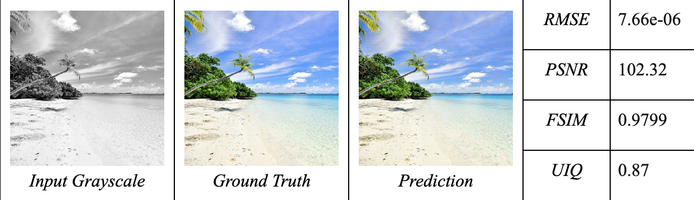
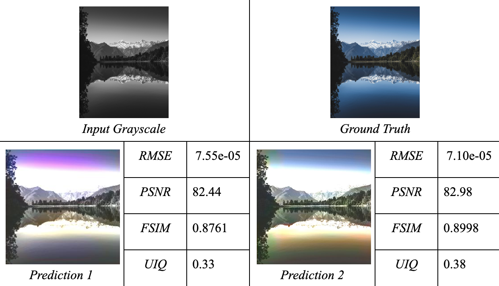
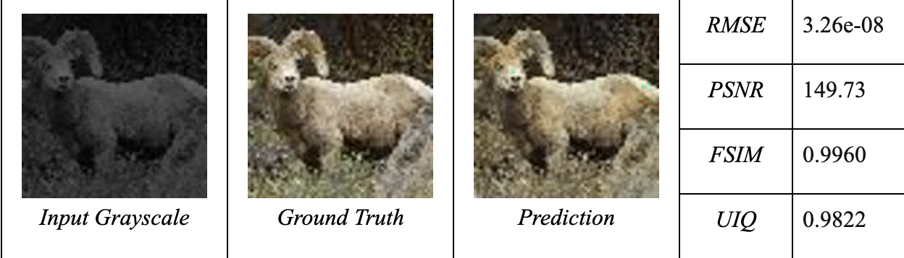

# Kewlarization
Image colorization using Deep neural network techniques

[Project Page](https://docs.google.com/document/d/1fVftGix7oQKbv8RJVrcg32wUZP8UkuLyyuD77DEFeR4/edit#heading=h.u1nhoxyp55w)

A collection of Deep Learning based Image Colorization techniques and corresponding source code/demo program.

## Prerequisites
- Linux or macOS
- Python 2 or 3

## Structure

1) extract_unsplash.ipynb - all the functions related to extracting image urls to jpg format
2) ImageColorization_With_GANs.ipynb - Pretty self explanatory ¯\_(ツ)_/¯
3) image_urls_unsplash.csv - image urls from the Unsplash lite dataset
4) model_training_baseline.ipynb (Baseline model)- Basic deep learning model trained on a single image
5) model_training_level2.ipynb - Similar to baseline model but with tiny-imageNet dataset

## Requirements

Install the following packages using pip

- Keras
- tensorflow-gpu
- scikit-image
- pandas

## Dataset preparation

Mainly we used a subset of [Tiny-ImageNet](http://www.image-net.org), [Unsplash lite dataset](https://github.com/unsplash/datasets) and [Face Images](https://github.com/2014mchidamb/DeepColorization/tree/master/face_images)
datasets to run the experiments. 

The following datasets are used for the specific experiments:

1) model_training_baseline.ipynb (Baseline experiment): Trained on a single image
2) model_training_level2.ipynb: Subset of the Tiny-ImageNet dataset (500 images)
3) ImageColorization_With_GANs.ipynb: ImageNet/all_kinds

## Experiments

## Examples

1) Baseline Experiments

2) Deep Convolution Experiment

3)  Generative Adversarial Networks

